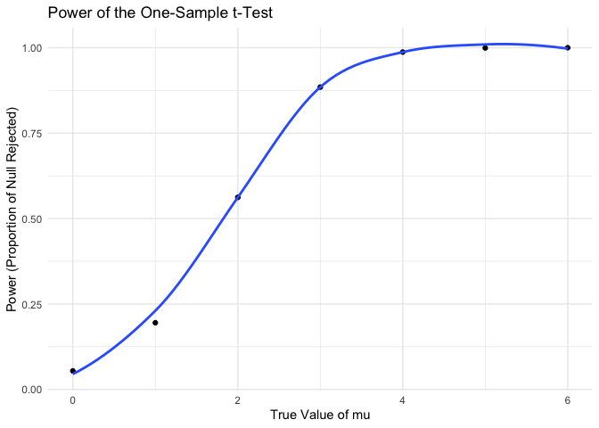

p8105_hw5_fp2513
================
2024-11-07

## Problem 1

``` r
birthday = sample(1:365, 10, replace = TRUE) %>% print()
```

    ##  [1] 141 299 240 169 324 220 170  17 174 103

``` r
if (any(duplicated(birthday))) {
  cat("TRUE")
} else {
  cat("FALSE")
}
```

    ## FALSE

``` r
check_duplicate_birthdays = function(n) {  
  
  birthdays = sample(1:365, n, replace = TRUE)
 
    has_duplicates = any(duplicated(birthdays))

    return(has_duplicates)
   
}

n = 10
result = check_duplicate_birthdays(n)
cat("Do at least two people share a birthday?", result, n)
```

    ## Do at least two people share a birthday? FALSE 10

For each group size, compute the probability that at least two people in
the group will share a birthday by averaging across the 10000 simulation
runs. Make a plot showing the probability as a function of group size,
and comment on your results.

``` r
n_list = 2:50

output = vector("list", length = length(n_list))

for (i in seq_along(n_list)) {
  
  output[[i]] <- rerun(10000, check_duplicate_birthdays(n = n_list[i])) %>%
    unlist() %>%
    as.data.frame() %>%
    setNames(paste0("group_size_", n_list[i]))
}
```

    ## Warning: `rerun()` was deprecated in purrr 1.0.0.
    ## ℹ Please use `map()` instead.
    ##   # Previously
    ##   rerun(10000, check_duplicate_birthdays(n = n_list[i]))
    ## 
    ##   # Now
    ##   map(1:10000, ~ check_duplicate_birthdays(n = n_list[i]))
    ## This warning is displayed once every 8 hours.
    ## Call `lifecycle::last_lifecycle_warnings()` to see where this warning was
    ## generated.

``` r
birthday_result_df = bind_cols(output)
averages = colMeans(birthday_result_df)

average_birthday_dup_df = 
  data.frame(
  group_size = n_list,
  average = averages
)

ggplot(average_birthday_dup_df, aes(x = group_size, y = average)) +
  geom_point() +
  labs(
    title = "Probability of At Least Two People Sharing a Birthday",
    x = "Group Size (n)",
    y = "Probability"
  ) +
  theme_minimal() 
```

<!-- -->

The plot follows a sigmoidal curve.

Where: At small group sizes (e.g., between 2 and 10 people), the
probability of at least two people sharing a birthday starts off low.
For very small groups, the probability is almost zero.

As group size increases, the probability increases rapidly.

For larger group sizes, the curve begins to level off and probability
approaches 1 (or 100%) because, with enough people, it becomes almost
certain that at least two will share a birthday.

## Problem 2

``` r
sim_power = function(samp_size = 30, mu = 0, sigma = 5, num_simulations = 5000, alpha = 0.05) {  
  
    run_simulation = function() {

          sample_data = rnorm(samp_size, mean = mu, sd = sigma)
          
          test_result = t.test(sample_data, mu = 0)
          
          result = broom::tidy(test_result)
    return(result)
    }
    
      results = replicate(num_simulations, run_simulation(), simplify = FALSE)

        results_df = bind_rows(results)

          power = mean(results_df$p.value < alpha)

    return(power)
}

sim_power_result = sim_power()
cat("Estimated power of the one-sample t-test: ", sim_power_result, n)
```

    ## Estimated power of the one-sample t-test:  0.0544 10

``` r
sim_power = function(samp_size = 30, mu_values = c(0, 1, 2, 3, 4, 5, 6), sigma = 5, num_simulations = 5000, alpha = 0.05) {  
  
  # Function to run one single power simulation
  run_simulation = function(mu) {
    sample_data = rnorm(samp_size, mean = mu, sd = sigma)
    test_result = t.test(sample_data, mu = 0)
    result = broom::tidy(test_result)
    return(result)
  }
  
  # Looping through each value of mu and running power simulations
  power_results = sapply(mu_values, function(mu) {
    results = replicate(num_simulations, run_simulation(mu), simplify = FALSE)
    results_df = bind_rows(results)
    power = mean(results_df$p.value < alpha)
    return(power)
  })
  
  # returning the result of power for each mu
  names(power_results) = mu_values
  return(power_results)
}

# running the simulation overall
sim_power_result = sim_power()
cat("Estimated power of the one-sample t-test for each value of mu: \n")
```

    ## Estimated power of the one-sample t-test for each value of mu:

``` r
print(sim_power_result)
```

    ##      0      1      2      3      4      5      6 
    ## 0.0494 0.1784 0.5552 0.8864 0.9912 0.9998 1.0000

``` r
sim_power_df = data.frame(
  mu = as.numeric(names(sim_power_result)),
  power = sim_power_result
)

ggplot(sim_power_df, aes(x = mu, y = power)) +
  geom_point() +
  geom_smooth(se = FALSE) +
  labs(title = "Power of the One-Sample t-Test",
       x = "True Value of mu",
       y = "Power (Proportion of Null Rejected)") +
  theme_minimal() 
```

    ## `geom_smooth()` using method = 'loess' and formula = 'y ~ x'

<!-- -->

Plots starts with low power when mu = 0 (since it is where the null
hypothesis is true). But as the true mean moves away from 0, effect size
increases, the power increases.

At small deviations from 0, such as mu = 1, the power is still
relatively low and likely due to that it cannot detect the difference
between null and alternative.

With increasing power this means that the test becomes more likely to
reject the null hypothesis as the difference between the null hypothesis
and the true mean grows.
